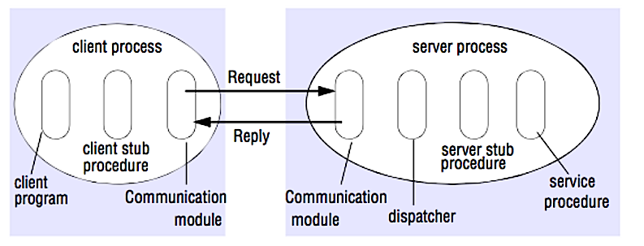

# API Architectures: The Senior SDE Guide

This guide breaks down the core API architectural styles and protocols, focusing on **trade-offs**, **internals**, and **production nuances** suitable for L4/L5 engineers.

---

## 1. REST (Representational State Transfer)
The *De facto* standard for public-facing web APIs.

### 1.1 Core Concept
*   **Philosophy**: Treat everything as a **Resource** (Noun) accessible via standard HTTP verbs (GET, POST, PUT, DELETE).
*   **Transport**: Almost exclusively HTTP/1.1 or HTTP/2.
*   **Payload**: Usually JSON (historically XML).
*   **Stateless**: The server stores no session state between requests. Every request must carry all necessary info (Auth tokens, etc.).

### 1.2 Senior SDE Nuances
*   **Richardson Maturity Model**:
    *   *Level 0*: The Swamp of POX (Plain Old XML) - single endpoint, everything is POST.
    *   *Level 1*: Resources (URIs).
    *   *Level 2*: HTTP Verbs (Standard methods).
    *   *Level 3*: **HATEOAS** (Hypermedia As The Engine Of Application State).
        *   *Reality Check*: Almost nobody implements Level 3 (HATEOAS) in production because it couples the client to the server’s state transitions too tightly, making versioning harder, not easier.
*   **Caching**: REST leverages HTTP caching natively (`ETag`, `Cache-Control`). This is its superpower vs. GraphQL/gRPC.
*   **Over-fetching/Under-fetching**: The classic downside.
    *   *Over-fetching*: Getting `/users/1` returns the entire User object when you only needed the `name`.
    *   *Under-fetching*: You need `User` + `Posts`. You hit `/users/1`, then `/users/1/posts` (N+1 problem).

---

## 2. GraphQL
The "Frontend-First" alternative to REST.

### 2.1 Core Concept
*   **Philosophy**: Give the client exactly what they ask for, nothing more, nothing less.
*   **Transport**: HTTP (Single Endpoint, usually POST).
*   **Payload**: JSON.
*   **Schema**: Strongly typed schema (SDL) acts as the contract.

### 2.2 Senior SDE Nuances
*   **The Complexity Shift**: GraphQL moves complexity from the **Client** (orchestrating multiple REST calls) to the **Server** (resolving deeply nested queries).
*   **Performance (N+1 Problem)**:
    *   *Scenario*: Querying a list of `Books` and their `Authors`.
    *   *Naive Implementation*: 1 DB query for Books, then 1 DB query *per Book* for the Author.
    *   *Solution*: **DataLoaders** (Batching and Caching request-response cycles).
*   **Security (DoS)**: A malicious client can ask for `User -> Friends -> User -> Friends...` infinitely.
    *   *Mitigation*: Query Depth Limiting & Complexity Analysis.
*   **Caching**: Hard. Since everything is a POST to `/graphql`, you lose standard HTTP caching. You must implement application-level caching (e.g., Apollo Client cache or Redis on server).

---

## 3. gRPC (Google Remote Procedure Call)
The "Microservices-First" standard.

RPC is a request-response protocol:

### 3.1 Core Concept
*   **Philosophy**: Call a function on a remote server as if it were local.
*   **Transport**: **HTTP/2** (strictly required).
*   **Payload**: **Protobuf** (Protocol Buffers) - Binary, compact.
*   **Contract**: `.proto` files define services and messages strictly.
*   **Flow**: 
    * Client program - Calls the client stub procedure. The parameters are pushed onto the stack like a local procedure call.
    * Client stub procedure - Marshals (packs) procedure id and arguments into a request message.
    * Client communication module - OS sends the message from the client to the server.
    * Server communication module - OS passes the incoming packets to the server stub procedure.
    * Server stub procedure - Unmarshalls the results, calls the server procedure matching the procedure id and passes the given arguments.
    * The server response repeats the steps above in reverse order. 

### 3.2 Senior SDE Nuances
*   **Performance**:
    *   *Binary serialization*: ~30-50% smaller and faster to parse than JSON.
    *   *Multiplexing*: Uses HTTP/2 to send multiple requests over a single TCP connection.
*   **Streaming**: gRPC supports native streaming:
    *   Server streaming (Stock ticker).
    *   Client streaming (File upload).
    *   Bidirectional streaming (Real-time game sync).
*   **Browser Limitations**: Browsers generally do **not** support full HTTP/2 (trailers, framing) needed for gRPC. You need **gRPC-Web** (a proxy/shim) to use it from a frontend.
*   **Coupling**: High. Both client and server need the generated code from the `.proto` file. Great for internal services, bad for public APIs.

---

## 4. WebSockets
The "Real-Time" tunnel.

### 4.1 Core Concept
*   **Philosophy**: Full-duplex communication over a single TCP connection.
*   **Transport**: Starts as HTTP, then "Upgrades" to raw TCP.
*   **Usage**: Chat apps, Live sports updates, Multiplayer gaming.

### 4.2 Senior SDE Nuances
*   **Stateful**: Heavily stateful. The server must keep the connection open and map it to a user. Scaling is hard (requires sticky sessions or a pub/sub layer like Redis to broadcast across server nodes).
*   **Load Balancing**: Tricky. Once a connection is established, it persists. A Load Balancer can't easily "move" an active WebSocket connection to a less busy server.
*   **Heartbeats**: You must implement Pings/Pongs. TCP half-open connections (ghost connections) are common where the server thinks the client is connected, but the client effectively disconnected hours ago.

---

## 5. Webhooks
The "Reverse API" (Don't call us, we'll call you).

### 5.1 Core Concept
*   **Philosophy**: Event-driven notifications via HTTP POST.
*   **Direction**: Server -> Client (Push).
*   **Usage**: Stripe payment confirmation, GitHub push events.

### 5.2 Senior SDE Nuances
*   **Security**: How do you know the request actually came from Stripe?
    *   *Signature Verification*: HMAC-SHA256 signature in the header using a shared secret.
*   **Reliability**: What if your server is down when stripe calls?
    *   *Retry Policies*: Exponential backoff is mandatory for the sender (Source).
    *   *Idempotency*: Your receiver *must* be idempotent. You might receive the same "Payment Success" webhook twice. Don't credit the user twice.
*   **Timeouts**: Webhook processing should be asynchronous. Receive the hook, push to a Queue (SQS/RabbitMQ), return distinct 200 OK immediately. Process later. Don't keep the source waiting.

---

## 6. SOAP (Simple Object Access Protocol)
The "Enterprise Legacy".

### 6.1 Core Concept
*   **Philosophy**: Formal, extensive standards for everything (Security, Atomicity, etc.).
*   **Transport**: Protocol agnostic (can use SMTP, TCP), but usually HTTP.
*   **Payload**: XML.
*   **Contract**: **WSDL** (Web Services Description Language).

### 6.2 Senior SDE Nuances
*   **WS-* Standards**:
    *   *WS-Security*: Built-in signing and encryption.
    *   *WS-AtomicTransaction*: Distributed transactions (Two-phase commit).
*   **Why it's dying**: Verbose XML, complex parsing, hard to debug.
*   **When to use**: Integration with legacy banking systems or government entities that mandate WS-Security features not easily replicated in REST/JSON.

---

## Comparative Decision Matrix

| Feature | REST | GraphQL | gRPC | WebSockets | Webhooks | SOAP |
| :--- | :--- | :--- | :--- | :--- | :--- | :--- |
| **Protocol** | HTTP/1.1 or 2 | HTTP/1.1 | **HTTP/2** | TCP (over HTTP) | HTTP | HTTP/SMTP |
| **Data Format** | JSON (Text) | JSON (Text) | **Protobuf (Binary)** | Binary/Text | JSON/Form | XML |
| **Coupling** | Loose | Medium | **Tight** (Schema) | Loose | Loose | Tight (WSDL) |
| **Caching** | **Excellent** (HTTP) | Poor (App logic) | Poor | N/A | N/A | Poor |
| **Browser Support**| Universal | Universal | **Requires Proxy** | Universal | Universal | Universal |
| **Use Case** | Public APIs, CRUD | Complex Data, Mobile | Internal Microservices | Real-time (Chat) | Event Notification | Enterprise/Legacy |

## Summary recommendation
*   **External/Public API**: Go **REST**. It's the standard.
*   **Mobile App with complex data**: Go **GraphQL** to minimize round-trips/bandwidth.
*   **Internal Microservices**: Go **gRPC**. The performance gains and strict typing are worth the setup.
*   **Real-time Chat/Game**: Go **WebSockets**.
*   **3rd Party Integration**: Go **Webhooks** for async updates.

**References**
* https://web.archive.org/web/20170608193645/http://etherealbits.com/2012/12/debunking-the-myths-of-rpc-rest/
* When are RPC more appropriate than REST - https://softwareengineering.stackexchange.com/questions/181176/when-are-rpc-ish-approaches-more-appropriate-than-rest/181186#181186
* https://www.quora.com/What-are-the-drawbacks-of-using-RESTful-APIs