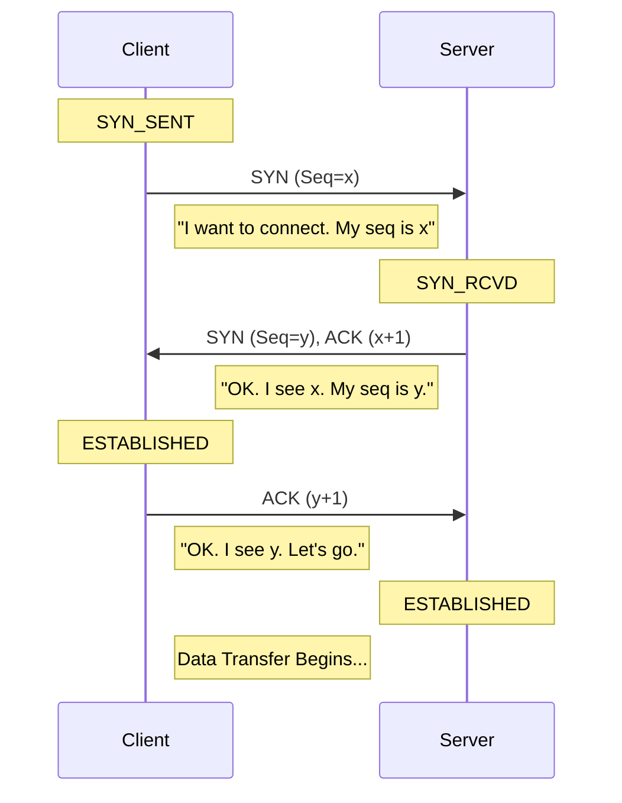
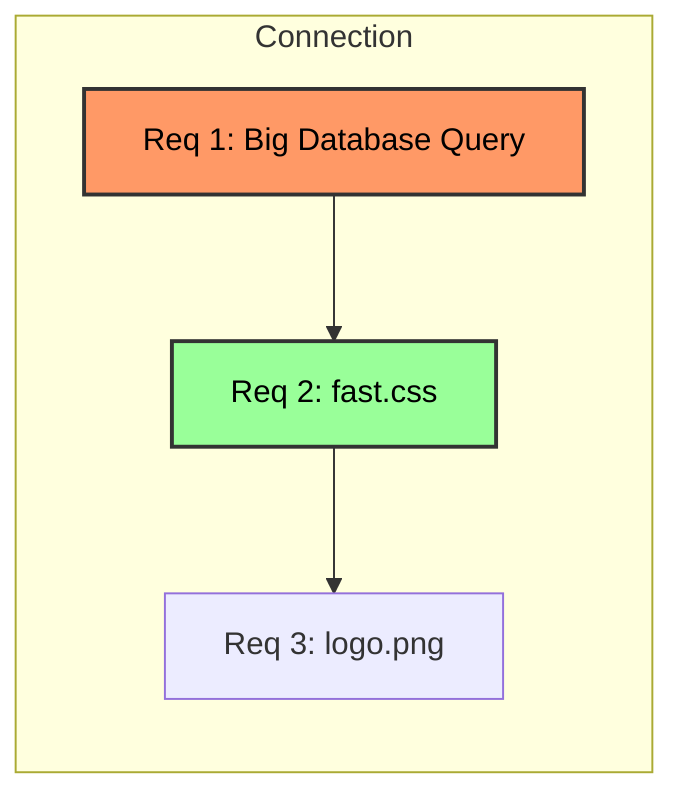

# Communication Protocols: The SDE 2 Guide

This guide bridges the gap between basic definitions (SDE 1) and production-level system design (SDE 2), focusing on **TCP, UDP, and HTTP**.

---

## 1. TCP (Transmission Control Protocol)
The "Reliable Workhorse" of the internet. It prioritizes **Reliability** and **Order** over speed.

### 1.1 The Basics (SDE 1)
TCP guarantees that your byte stream arrives intact and in order. It manages the connection lifecycle explicitly.

#### Connection Establishment: The 3-Way Handshake
Before sending data, we must agree on initial Sequence Numbers.



*   **Cost**: 1.5 Round Trip Times (RTT) before a single byte of application data is sent.

### 1.2 The Advanced (SDE 2)
How does TCP behave under load? This is where latency issues usually hide.

#### Flow Control vs. Congestion Control
This is a common interview confusion.
*   **Flow Control**: Protects the **Receiver**.
    *   The Receiver advertises a `Window Size` (RWND) in the packet header.
    *   *Analogy*: "My inbox has space for 5 more emails. Don't send 6."
*   **Congestion Control**: Protects the **Network** (the internet).
    *   The Sender maintains a `Congestion Window` (CWND) based on network health.
    *   *Analogy*: "The road is congested. I'll drive slower so I don't cause a traffic jam."

#### Congestion Algorithms: CUBIC vs. BBR
*   **TCP CUBIC** (Standard Linux default):
    *   Increases speed until **Packet Loss** occurs.
    *   *Problem*: It fills network buffers ("Bufferbloat") before backing off, causing high latency.
*   **TCP BBR** (Bottleneck Bandwidth and Round-trip propagation time - by Google):
    *   Does **not** rely on packet loss.
    *   It models the pipe's bandwidth and RTT to send exactly as much data as the pipe can handle.
    *   *Result*: Higher throughput, lower latency on spotty networks.

#### Production Pitfall: Nagle's Algorithm & Delayed ACK
A classic performance killer in Request/Response systems.
*   **Nagle's Algorithm**: "Wait to bundle small packets together to make a full segment." (Saves bandwidth).
*   **Delayed ACK**: "Wait a bit before ACKing to see if I can piggyback the ACK on a response." (Saves bandwidth).

**The Deadlock**:
1.  App sends a small request header (Nagle holds it, waiting for more data).
2.  Server waits continuously for the full packet to arrive before ACKing.
3.  **Result**: 40ms - 200ms artificial latency on every request.
*   **Fix**: Set `TCP_NODELAY = true` (Disable Nagle) on your sockets.

---

## 2. UDP (User Datagram Protocol)
The "Fire and Forget" protocol. It gives you raw access to the network card with minimal oversight.

### 2.1 The Basics
*   **Header**: Tiny (8 bytes). Just Source Port, Dest Port, Length, Checksum.
*   **Semantics**: No Handshake, No ACIs, No Retries, No Ordering.

### 2.2 The Advanced (SDE 2)
Why would we use such an "unreliable" protocol?

#### The "Head-of-Line" (HOL) Advantage
In TCP, if Packet 5 is dropped, Packet 6-10 wait (are blocked) until Packet 5 is retransmitted. The OS hides the "gap" from the application.
In UDP, Packet 6-10 are delivered immediately. This is critical for:
*   **Voice/Video**: Better to hear a glitchy millisecond of audio than have the whole conversation pause for 2 seconds.
*   **Gaming**: If I missed the "player moved left" packet, I don't want it 200ms later. I want the *current* position packet.

#### MTU and Fragmentation
*   **MTU (Maximum Transmission Unit)**: The largest packet the internet can handle (~1500 bytes for Ethernet).
*   **Problem**: If you send a 4KB UDP packet, IP splits it into 3 fragments.
    *   If *one* fragment is lost, the *entire* 4KB is invalid.
    *   Middleboxes often drop fragments (security reasons).
*   **Solution**: **Path MTU Discovery**. Determine the max size allowed and never send a UDP packet larger than that.

#### Reliable UDP? (QUIC)
New protocols (like HTTP/3) implement reliability **on top of UDP** in user-space. This allows them to iterate on congestion control algorithms without waiting for OS Kernel updates.

---

## 3. HTTP Evolution
How we moved from "One-request-per-connection" to "Everything-everywhere-all-at-once".

### 3.1 HTTP/1.1: The Bottleneck
*   **Keep-Alive**: We kept the TCP connection open, but requests had to be serial.
*   **Problem**: Head-of-Line (HOL) Blocking at the Application Layer.


*   *Issue*: `fast.css` is blocked behind the slow Database Query. The client cannot get the CSS until the Query finishes.

### 3.2 HTTP/2: Multiplexing (The Solution)
H2 breaks requests into binary **Frames** and interleaves them.

```mermaid
graph LR
    subgraph Connection
    mix[Stream 1 (Data) | Stream 2 (Header) | Stream 1 (Data) | Stream 3 (Data)]
    end
```
*   **Result**: Even if Stream 1 (DB Query) is slow/generating, the server can slip in frames for Stream 2 (CSS) in between.
*   **Remaining Problem**: **TCP Layer HOL Blocking**. If a single TCP packet drops, the OS pauses the *entire* connection (all streams) to wait for the retransmit.

### 3.3 HTTP/3 (QUIC): The Final Frontier
Runs on **UDP**.
*   **Streams**: Independent at the transport level.
*   **Loss Isolation**: If Packet A (Stream 1) is lost, Stream 2 continues flowing perfectly.
*   **Connection Migration**:
    *   *Scenario*: You leave your house (WiFi) and switch to Data (5G). Your IP address changes.
    *   *TCP/HTTP2*: Connection breaks. Must re-handshake.
    *   *HTTP3*: Uses a **Connection ID** (CID). The server sees the same CID and keeps talking to you seamlessly despite the new IP.

---

## Summary Cheatsheet for System Design

| Feature | TCP | UDP | HTTP/1.1 | HTTP/2 | HTTP/3 |
| :--- | :--- | :--- | :--- | :--- | :--- |
| **Transport** | - | - | TCP | TCP | UDP (QUIC) |
| **Reliability** | Yes (in Kernel) | No | Yes | Yes | Yes (in User-space) |
| **Multiplexing** | No | No | No | Yes | Yes |
| **HOL Blocking** | Yes | No | Yes (App) + Yes (Transport) | Yes (Transport) | No |
| **Best For** | Accuracy (Billing, DB) | Speed (Live Video) | Simple APIs | Web Browsing (High concurrency) | Unstable Networks (Mobile) |

## References
* https://en.wikipedia.org/wiki/Flow_control_(data)
* https://en.wikipedia.org/wiki/Network_congestion#Congestion_control
* https://en.wikipedia.org/wiki/Connection_pool
* https://www.cyberciti.biz/faq/key-differences-between-tcp-and-udp-protocols/
* https://en.wikipedia.org/wiki/Transmission_Control_Protocol
* https://en.wikipedia.org/wiki/User_Datagram_Protocol