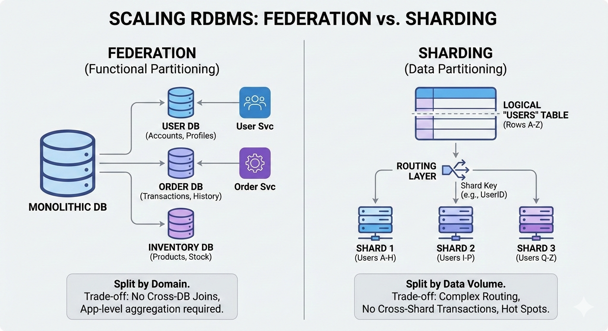

This document details advanced RDBMS architectural patterns, tailored for Senior Software Engineers (Amazon SDE II / Google L4). It focuses on scaling strategies, implementation nuances, and the critical trade-offs required for system design interviews and real-world application design.

The content is derived from industry-standard principles found in the System Design Primer.

## High-Scale RDBMS Architecture & Design Patterns
## 1. Master-Slave Replication
Replication is the foundation of read-scalability and durability. In this model, the Master handles all writes and propagates changes to one or more Slaves (replicas), which serve read queries.

Deep Dive
### Replication Mechanisms

**Statement-Based**: Replicates the SQL statement (e.g., DELETE FROM users WHERE age > 10). Risk: Non-deterministic functions like NOW() or RAND() can cause drift.

**Write-Ahead Log (WAL) / Binary Log**: Replicates the actual data changes (byte-level). This is the industry standard for data integrity.

### Sync vs. Async

**Asynchronous**: Master commits immediately. Slaves catch up eventually. High performance, risk of data loss on Master failure.

**Semi-Synchronous**: Master waits for at least one slave to acknowledge receipt before committing. Balances durability and latency.

**Trade-offs & Risks**
Senior Engineer Note: The biggest pitfall here is Replication Lag. If the Master writes faster than Slaves can apply changes (often single-threaded in older DB versions), users may see stale data (violating strict consistency).

**Consistency Model**: Eventual Consistency. You must handle "read-your-own-writes" issues (e.g., a user updates their profile and immediately reloads the page; the read might hit a lagging slave).

**Failover Complexity**: Promoting a slave to master is not trivial. You risk a Split-Brain scenario if the old master comes back online and thinks it is still the leader.

## 2. Master-Master Replication
Also known as Active-Active or Multi-Master replication. Multiple nodes accept writes and replicate them to each other.

**Deep Dive**
Use Cases: multi-region deployments where you need local write latency for users in different geographies.

**Circular Replication**: Preventing infinite loops where Node A updates Node B, which updates Node A again. Usually handled by tagging transaction IDs with server IDs.

**Trade-offs & Risks**
Conflict Resolution: This is the hardest operational challenge. If Node A and Node B update the same row at the same time, who wins?

**Last-Write-Wins (LWW)**: Relies on synchronized clocks (unreliable).

**Application Logic**: The app must decide (complex).

**Auto-Increment Keys**: You cannot use simple auto-increment primary keys. You must use UUIDs (performance hit on indexing) or Ticket Servers (centralized bottleneck) or offset incrementing (Node A: 1, 3, 5... Node B: 2, 4, 6...).

## 3. Federation (Functional Partitioning)
Federation splits the database by function/domain rather than data volume. For example, separating User DB, Order DB, and Inventory DB.

**Deep Dive**
Microservices Alignment: Federation often naturally follows a microservices migration. It enforces strict boundaries between service domains.

**Failure Isolation**: A massive load spike on the Order DB will not bring down the User DB (login capabilities remain intact).

**Trade-offs & Risks**
Cross-Database Joins: You lose the ability to perform SQL JOINs across domains.

**Solution**: You must perform joins in the Application Layer (fetching data from both DBs and merging in memory), which increases latency and code complexity.

**Distributed Transactions**: Ensuring atomicity across federated databases requires Two-Phase Commit (2PC) or Saga Patterns, both of which significantly increase system complexity compared to a local ACID transaction.

## 4. Sharding (Data Partitioning)
Sharding distributes data across multiple nodes based on a Shard Key. Unlike Federation, the schema is the same on all nodes; only the data rows differ.

Deep Dive
### Sharding Strategies

**Key Based (Hash)**: hash(user_id) % num_servers. Good distribution, but resizing the cluster (adding servers) requires re-hashing huge amounts of data.

**Range Based**: IDs 1-100k on Node A, 100k-200k on Node B. Easy to split, but leads to Hot Spots (e.g., if IDs are time-based, all new writes go to the newest node).

**Directory Based**: A lookup table tracks which shard holds which key. Flexible, but the lookup table becomes a single point of failure and bottleneck.

**Consistent Hashing**: Critical for minimizing data movement when scaling the cluster up or down.

**Trade-offs & Risks**
Senior Engineer Note: Sharding is operationally expensive. Avoid it until absolutely necessary (e.g., when you exceed the write capacity or storage limits of a single master).

**The "Celebrity" Problem**: If one user (e.g., Justin Bieber on Twitter) generates 1000x more activity than others, the shard hosting that user becomes a hot spot, causing uneven load.

**Cross-Shard Queries**: Queries that don't include the Shard Key require a "Scatter-Gather" approach (querying all shards), which is extremely inefficient and slow.

## 5. Denormalization
Deliberately introducing redundancy to the database schema to optimize read performance at the expense of write performance.

**Deep Dive**
Materialized Views: Pre-calculating complex joins or aggregations (e.g., TotalOrders per user) and storing the result as a physical table.

**Star Schema**: Used in Data Warehousing, optimizing for analytical reads rather than transactional writes.

**Trade-offs & Risks**
Write Amplification: A single update to the source of truth might require updating 5 different denormalized tables.

**Data Consistency**: The redundant data can drift out of sync. You must decide if "stale data" is acceptable for the specific use case (e.g., showing a "Like count" that is off by a few digits is usually fine; showing an incorrect "Bank Balance" is not).

## 6. SQL Tuning & Optimization
Before scaling horizontally (Sharding), you should always optimize vertically and logically.

## Deep Dive
### Indexing Strategy

**B-Trees**: The standard for RDBMS. Good for range queries and equality.

**Covering Indexes**: Creating an index that contains all the fields required by the query, allowing the DB to serve the request directly from the index structure without touching the table storage (heap).

### Query Analysis

Understanding EXPLAIN plans (Full Table Scan vs. Index Seek).

Avoiding SELECT * to reduce network I/O and memory usage.

**Trade-offs & Risks**
Index Overhead: Every index speeds up reads but slows down writes (because the B-Tree must be rebalanced on INSERT/UPDATE).

Maintenance: Indexes fragment over time and require maintenance windows (VACUUM/Rebuild) which can lock tables or consume IOPS.

## References
* https://www.youtube.com/watch?v=kKjm4ehYiMs
* https://en.wikipedia.org/wiki/Shard_(database_architecture)
* https://www.paperplanes.de/2011/12/9/the-magic-of-consistent-hashing.html
* https://highscalability.com/an-unorthodox-approach-to-database-design-the-coming-of-the/
* https://stackoverflow.com/questions/1217466/is-there-a-good-reason-i-see-varchar255-used-so-often-as-opposed-to-another-l
* https://stackoverflow.com/questions/1017239/how-do-null-values-affect-performance-in-a-database-search