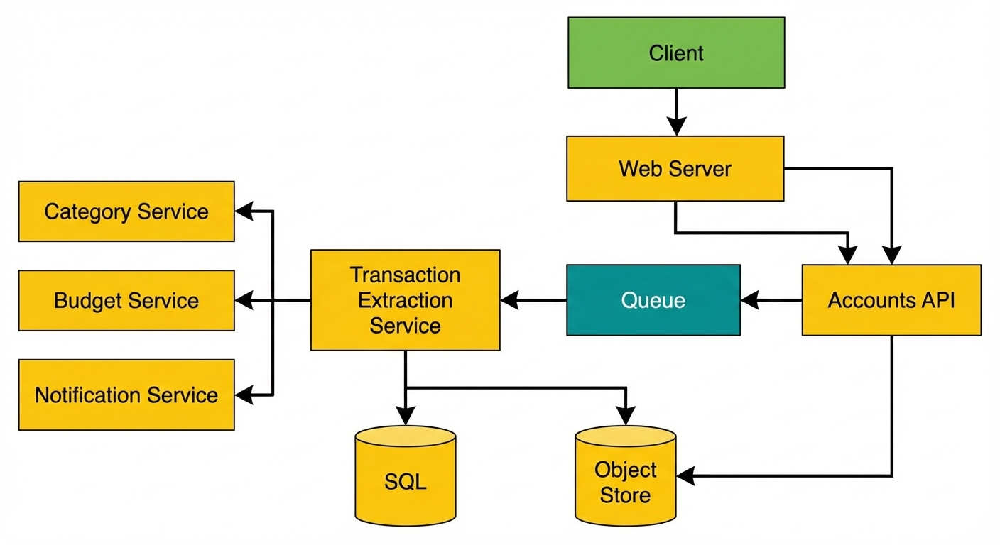
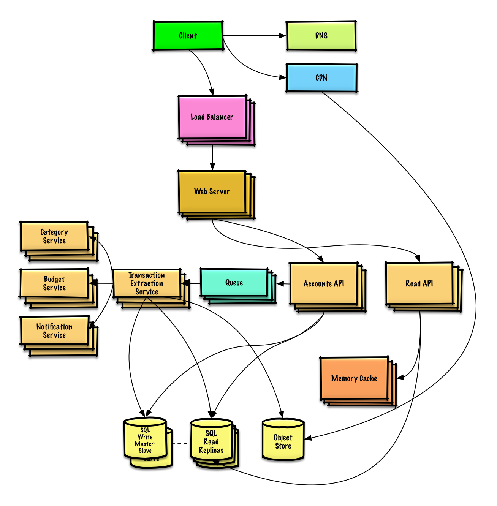

# Design Mint.com/Credit karma

## Step 1: Outline use cases and constraints

### Use Cases
* **User** connects to the financial account
* **Service** extracts transactions from the account
    * Updates daily
    * Categorizes transactions
        * Allows manual category override by the user
        * No automatic re-categorization
    * Analyzes monthly spending, by category
* **Service** recommends a budget
    * Allows user to manually set a budget
    * Sends notifications when approaching or exceeding budget
* **Service** has high availability

### Out of Scope
* **Service** performs additional logging and analytics

### Constraints and assumptions

#### State assumptions
* Traffic is not evenly distributed
* Automatic daily update of accounts applies only to users active in the past 30 days
* Adding or removing financial accounts is relatively rare
* Budget notifications don't need to be instant
* 10 million users
    * 10 budget categories per user = 100 million budget items
    * Example categories:
        * Housing - $1000
        * Food - $200
        * Gas - $100
    * Sellers are used to determine transaction category
        * 50,000 sellers
* 30 million financial accounts
* 5 billion transactions per month
* 500 million read requests per month
* 10:1 write to read ratio 
    * Write-heavy, users make transactions daily, but few visit the site daily

#### Calculate usage
* Size per transaction
    * user_id - 8 bytes
    * created_at - 5 bytes
    * seller - 32 bytes
    * amount - 5 bytes
    * Total ~ 50 bytes
* 250 GB of new transaction content per month
    * 50 bytes per transaction * 5 billion transactions per month
    * 9 TB of new transaction content in 3 years
    * Assume most are new transactions instead of update to existing ones
* 2000 transactions per second on average
* 200 read requests per second on average

Handy conversion guide:
* 2.5 million requests per month
* 1 request per second = 2.5 million requests per month
* 40 requests per second = 100 million requests per month
* 400 requests per second = 1 billion requests per month

## Step 2: High Level Design

## Step 3: Design Core Components

### Use case: User connects to a financial account
We could store info on the 10 million users in a relational database.
* The **Client** sends a request to the **Web Server**, running as a reverse proxy
* The **Web Server** forwards the request to the **Accounts API** server
* The **Accounts API Server** updates the SQL database *accounts* table with the newly entered
account info

The *accounts* table have the following structure:
id int NOT NULL AUTO_INCREMENT
created_at datetime NOT NULL
last_update datetime NOT NULL
account_url varchar(255) NOT NULL
account_login varchar(32) NOT NULL
account_password_hash char(64) NOT NULL
user_id int NOT NULL
PRIMARY KEY(id)
FOREIGN KEY(user_id) REFERENCES users(id)

We'll create an index on id, user_id, and created_at.

public REST api
'''$ curl -X POST --data '{ "user_id": "foo", "account_url": "bar", \
    "account_login": "baz", "account_password": "qux" }' \
    https://mint.com/api/v1/account'''

For internal communication, we'll use **RPCs**

Next, the service extracts transactions from the account

### Use Case: Service extracts transactions from the account
We'll want to extract information from an account in these cases:
* The user first links the account
* The user manually refreshes the account
* Automatically each day for users who have been active in the past 30 days

Data Flow:
* The **Client** sends a request to **Web Server**
* The **Web Server** forwards the request to the **Accounts API** server.
* The **Accounts API** server places a job on a Queue such as **Amazon SQS** or **RabbitMQ**.
    * Extracting transactions could take a while, we'd probably want to do this 
    asynchronously with a queue, although this introduces additional complexity
* The **Transaction Extraction Service** does the following:
    * Pulls from the **Queue** and extracts transactions for the given account from the 
    financial institution, storing the results as raw log files in the **Object Store**
    * Uses the **Category Service** to categorize each transaction
    * Uses the **Budget Service** to calculate aggregate monthly spending by category
        * The **Budget Service** uses the **Notification Service** to let users know if they
        are nearing or have exceeded their budget.
    * Updates the **SQL Database** *transactions* table with categorized transactions
    * Updates the **SQL Database** *monthly_spending* table with aggregate monthly spending by
    category
    * Notifies the user the transactions have completed through the **Notification Service**
        * Uses a **Queue** to asynchronously send out notifications

The *transactions* table could have the following structure:
id int NOT NULL AUTO_INCREMENT
created_at datetime NOT NULL
seller varchar(32) NOT NULL
amount decimal NOT NULL
user_id int NOT NULL
PRIMARY KEY(id)
FOREIGN KEY(user_id) REFERENCES users(id)

Index on user_id, id, and created_at

The *monthly_spending* table could have following structure:
id int NOT NULL AUTO_INCREMENT
month_year date NOT NULL
category varchar(32)
amount decimal NOT NULL
user_id int NOT NULL
PRIMARY KEY(id)
FOREIGN KEY(user_id) REFERENCES users(id)

Index on id, user_id

**Category Service**
For the category service, we can seed a seller-to-category dictionary with the most popular
sellers. If we estimate 50,000 sellers and estimate each entry to take less than 255 bytes, 
the dictionary will only be 255*50,000 ~ 12MB of memory

class DefaultCategories(Enum):

    HOUSING = 0
    FOOD = 1
    GAS = 2
    SHOPPING = 3
    ...

seller_category_map = {}
seller_category_map['Exxon'] = DefaultCategories.GAS
seller_category_map['Target'] = DefaultCategories.SHOPPING
...

Transaction implementation

class Transaction(object):

    def __init__(self, created_at, seller, amount):
        self.created_at = created_at
        self.seller = seller
        self.amount = amount

### Use Case: Service recommends a budget
Lazy Evaluation + Delta Storage

To start, we could use a generic budget template that allocates category amounts based on 
income tiers. Using this approach, we would not have to store the 100 million budget items
identified in the constraints, only those that the user overrides. If a user override a budget
category, which we could store the override in the TABLE *budget_overrides*

class Budget(object):

    def __init__(self, income):
        self.income = income
        self.categories_to_budget_map = self.create_budget_template()

    def create_budget_template(self):
        return {
            DefaultCategories.HOUSING: self.income * .4,
            DefaultCategories.FOOD: self.income * .2,
            DefaultCategories.GAS: self.income * .1,
            DefaultCategories.SHOPPING: self.income * .2,
            ...
        }

    def override_category_budget(self, category, amount):
        self.categories_to_budget_map[category] = amount

CREATE TABLE budget_overrides (
    user_id UUID,
    category_id INT,
    manual_amount DECIMAL,
    PRIMARY KEY (user_id, category_id)
);

**1. The Template + Delta Strategy**
Minimize storage by assuming every user follows a default pattern based off on
their income
* **The Template (Base)**: Your *Budget* class calculates a "virtual" budget on the fly.
If a user makes a $5000/month, the code instantly knows Housing is $2,000 (0.4 * 5000).
This costs zero database space
* **The Override (The Delta)**: You only write to *TABLE budget_overrides* when a user says,
"Actually, I spend $2500 on rent".
* **The Merge**: When the app displays the budget, it performs a "Left Join" logic: Use the 
override if it exists; otherwise, use the template value

**2. The Data Pipeline: Processing 5 Billion Transactions**
Processing 5 billion transactions in a standard SQL database is slow and expensive. 
Proposed two ways to handle this "Heavy Lifting"

**Option A: The SQL Approach (Micro-batching)**
You aggregate raw transactions into a *monthly_spending* table
**Pros**: Easy to query with standard tools
**Cons**: Frequent writes can lock up the database if 100 million users are all 
transacting at the same time.

**Option B: The MapReduce Approach (The Big Data Way)**
Much more scalable for "5 billion transactions". Instead of hitting the live database,
you process raw logs (files) in parallel.

* **Map Step**: Look at every transaction. Emit a key pair: (UserId, Month, Category, Amount)
* **Shuffle/Sort**: Group all "Food" transactions for "User A" together. Group by 
category and user_id
* **Reduce Step**: Sum the amounts. UserA | January | Food | $610

**3. Service Interaction Flow**
How do these pieces talk to each other ? 
1. **User Views Budget**: The UI calls the **Budget Service**
2. **Service calculates**: The service fetches the user's income, runs the 
*create_budget_template()*, and then queries the *budget_overrides* table to see if it
needs to swap any value
3. **Comparison**: The service then pulls the aggregated data from the *monthly_spending*
table (generated by MapReduce) to show the user: "You spent $650 of your $500 Food budget"
4. **User Updates**: If the user changes a category (eg. tags a "Gas" transaction as "Travel"),
the **Budget Service** triggers a re-run of the analysis for that specific user to keep the 
"Spent Vs Budget" bar charts accurate

## Step 4: Scaling the system

