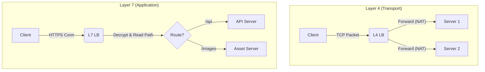

# Load Balancer vs Reverse Proxy: A Deep Dive (SDE2)

> **Reference**: This guide draws heavily from concepts found in [Donne Martin's System Design Primer](https://github.com/donnemartin/system-design-primer).

## Introduction

As systems scale from a single server to distributed architectures, managing incoming traffic efficiently becomes critical. Two key components in this layer are **Load Balancers** and **Reverse Proxies**. While they often share overlapping functionality (and modern tools like NGINX or HAProxy can act as both), they serve distinct primary purposes.

This document explores their architectures, differences, similarities, and use cases, targeting an SDE2 level understanding.

---

## 1. Load Balancer

A **Load Balancer** is a device or software that acts as a reverse proxy and distributes network or application traffic across a number of servers. Load balancers are used to increase capacity (concurrent users) and reliability of applications.

### Core Responsibilities
*   **Traffic Distribution**: Spreading requests across multiple compute resources (horizontal scaling).
*   **Health Checks**: Periodically monitoring the health of backend servers. If a server fails, the load balancer stops sending traffic to it (High Availability).
*   **Session Persistence (Sticky Sessions)**: Ensuring requests from a specific client are always routed to the same backend server (if required).

### Operational Layers (L4 vs L7)
SDE2s should understand where load balancing occurs in the OSI model:

#### Layer 4 Load Balancing (Transport Layer)
*   **Decision Basis**: IP range/domain and port (TCP/UDP).
*   **Mechanism**: The LB forwards network packets to and from the upstream server without inspecting the content of the packets.
*   **Pros**: Extremely fast, efficient, secure (packet content is not decrypted).
*   **Cons**: No "smart" routing based on content (e.g., cannot route `/video` to a different server than `/images`).

#### Layer 7 Load Balancing (Application Layer)
*   **Decision Basis**: Content of the message (HTTP Query, Headers, Cookies, URL).
*   **Mechanism**: The LB terminates the network traffic, reads the message, makes a decision, and opens a new connection to the selected server.
    *   *What does "Terminates" mean?*: Unlike L4 where packets are just forwarded, an L7 LB acts as the *actual destination* for the client's TCP connection. It completes the TCP handshake with the client (SYN/ACK), buffers the data until it receives a full HTTP request, and *then* initiates a separate, new TCP connection to the backend server. The client and backend server never talk directly.
*   **Pros**: Smart routing (e.g., microservices routing based on URL path), caching, compression.
*   **Cons**: Higher CPU usage (requires decryption/re-encryption if HTTPS).

### Visualizing the Difference

### Common Algorithms
*   **Round Robin**: Sequential distribution.
*   **Least Connections**: Sends to server with fewest active connections.
*   **IP Hash**: Hash of IP determines server (persistence).

---

## 2. Reverse Proxy

A **Reverse Proxy** is a server that sits in front of one or more web servers, intercepting requests from clients. This is different from a "Forward Proxy" which sits in front of clients (like a corporate firewall/proxy used to access the web).

### Core Responsibilities
While a Load Balancer *distributes* traffic, a Reverse Proxy *unifies* and *protects* backend services, often providing:

*   **Security (Anonymity)**: Hides the IP addresses and topology of the backend servers. The client only sees the Reverse Proxy's IP.
*   **SSL Termination (Encryption Offloading)**: Decrypts incoming requests and communicates with backend servers via HTTP (or less expensive encryption), saving backend resources.
*   **Caching**: Stores static content or cached API responses to serve clients directly, reducing load on backend servers.
*   **Compression**: Compresses outgoing responses (e.g., Gzip) to speed up load times.
*   **Serving Static Content**: Directly serves HTML/CSS/JS/Images, bypassing the application server.

#### Deep Dive: SSL Termination
For an SDE2, understanding **SSL Termination** is crucial for performance and security discussions.

*   **What it is**: The process where the Load Balancer or Reverse Proxy handles the incoming encrypted HTTPS connection, decrypts the data, and passes unencrypted HTTP traffic to the backend server within a secure private network (VPC).
*   **Why do it?**:
    *   **Performance (CPU Offloading)**: Decrypting SSL/TLS handshakes is CPU-intensive. By offloading this to a specialized proxy, your application servers can focus entirely on business logic rather than cryptography.
    *   **Certificate Management**: You only need to manage and renew SSL certificates on the Proxy/LB layer, rather than on hundreds of backend instances.
    *   **Security Inspection**: A WAF (Web Application Firewall) on the proxy can only inspect traffic for malicious patterns (SQL Injection, XSS) if it can read the decrypted data.

---

## 3. Comparison

### Similarities
1.  **Intermediaries**: Both sit between the client and the server application.
2.  **Traffic Management**: Both handle incoming requests and route them to backend services.
3.  **Hardware/Software**: Often implemented using the same software (NGINX, HAProxy, Traefik) or hardware (F5).
4.  **Reliability**: Both typically implement health checks to avoid sending traffic to dead servers.

### Differences

| Feature | Load Balancer | Reverse Proxy |
| :--- | :--- | :--- |
| **Primary Goal** | **Scale & Availability**. Distribute load across multiple servers. | **Security & Unification**. Present a single face to the world; offload non-app tasks. |
| **Backend Awareness** | Typically assumes multiple *identical* backend servers. | Can route to *different types* of services (e.g., `/blog` to Service A, `/api` to Service B). |
| **Scaling Focus** | Horizontal Scaling (adding more servers). | Vertical Offloading (caching, SSL, compression). |
| **Deployment** | Usually required when you have >1 server. | Can be useful even with just 1 server (for security/SSL). |
| **Client Visibility** | Client might know it's hitting a cluster (though LB tries to hide it). | Client thinks it is talking to the origin server directly. |

---

## 4. System Design: When to use what?

### Use a Load Balancer when:
*   You have too much traffic for a single server.
*   You need to eliminate a Single Point of Failure (SPOF) by having multiple application instances.
*   You need to perform maintenance on servers without downtime (drain connections from one server).

### Use a Reverse Proxy when:
*   You want to expose a single public IP/URL for multiple internal services (Microservices Gateway pattern).
*   You need to terminate SSL/TLS simply.
*   You want to cache static assets or API responses at the edge of your network.
*   You want to protect backend servers from direct internet exposure (DDoS mitigation, IP masking).

### The Reality: You often use both (or one tool for both)
In a modern SDE2 system design interview or production environment:
*   **NGINX** often acts as **both**. It terminates SSL (Reverse Proxy), checks for cached content (Reverse Proxy), and if not found, distributes the request to one of several backend application servers (Load Balancer).
*   **Cloud Load Balancers (AWS ALB/GLB)** are technically managed Layer 7 Load Balancers that also act as Reverse Proxies (handling SSL, path-based routing).

> **SDE2 Insight**: Don't think of them as mutually exclusive boxes. Think of "Load Balancing" and "Reverse Proxying" as *functions* or *roles*. A single component often performs both roles.

# References
* https://en.wikipedia.org/wiki/X.509
* https://www.haproxy.org/download/1.2/doc/architecture.txt
