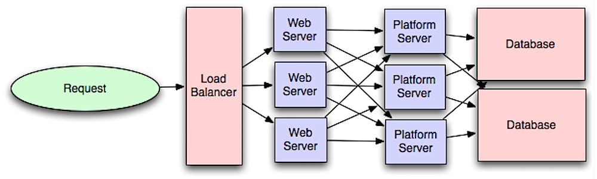

# System Design Concepts: A Deep Dive (SDE2/L4)

This document provides a comprehensive comparison of architectural patterns and components essential for system design discussions at the Senior Software Engineer level (SDE2 Amazon / L4 Google). It references concepts found in Donne Martin's System Design Primer.

---

## 1. Monolithic vs. Microservices Architecture

### Monolithic Architecture
A monolithic application is built as a single, unified unit. All functional components—such as database access, business logic, and UI rendering—are tightly coupled and deployed together.

**Key Characteristics:**
- **Single Codebase:** All modules live in one repository.
- **Single Deployment Unit:** The entire app is built into one executable (e.g., a `.war` file or a single binary) and deployed to a server.
- **Shared Resources:** Components share the same memory space, database connections, and often the same underlying database.

| Pros | Cons |
| :--- | :--- |
| **Simpler Deployment** (initially): Just one file to copy. | **Scalability Limits:** You must scale the *entire* application even if only one module is bottlenecked. |
| **Performance:** Inter-module calls are in-process function calls (extremely fast). | **Tight Coupling:** A distinct failure in one module (e.g., a memory leak) brings down the entire system. |
| **Easy Inter-module Refactoring:** IDEs handle refactoring across the whole codebase easily. | **Technology Lock-in:** Hard to adopt new languages or frameworks for specific components. |
| **Simplified Testing:** Easy to run end-to-end integration tests locally. | **Organizational Friction:** As teams grow, merge conflicts and coordination overhead increase significantly (Conway's Law). |

### Microservices Architecture
Microservices architecture structures an application as a collection of loosely coupled, independently services. Each service corresponds to a specific business capability.

**Key Characteristics:**
- **Decentralized:** Each service has its own codebase, CI/CD pipeline, and often its own database (database-per-service pattern).
- **Independent Deployment:** Services can be updated and deployed without affecting the rest of the system.
- **Network Communication:** Services communicate over the network via synchronous protocols (HTTP/REST, gRPC) or asynchronous messaging (RabbitMQ, Kafka).

| Pros | Cons |
| :--- | :--- |
| **Independent Scaling:** Scale only the service that needs it (e.g., scale "Payments" but not "User Profile"). | **Complexity:** Distributed systems introduce fallacies of networking (latency, packet loss, network partitions). |
| **Fault Isolation:** A crash in one service doesn't necessarily cascade to others (if circuit breakers are used). | **Data Consistency:** Managing distributed transactions (Saga pattern, 2PC) is far harder than ACID transactions in a monolith. |
| **Tech Stack Flexibility:** Use Node.js for I/O heavy services, Python for ML, Go for high concurrency. | **Operational Overhead:** Requires mature DevOps, monitoring, observability (tracing), and infrastructure automation. |
| **Faster Time-to-Market:** Independent teams can release features in parallel. | **Testing Difficulty:** Integration testing requires spinning up multiple services or using contract testing (Pact). |

**SDE2 Insight:**
For an interview, don't blindly recommend microservices. **"Start with a monolith"** is often the right answer for new products. Microservices solve organizational scaling problems more than technical ones. Transition when the monolith becomes too large for a single team to manage effectively.

---

## 2. Application Server vs. Web Server

While often used interchangeably or bundled together, these two components serve distinct roles in a tiered architecture.

### Web Server
A **Web Server** is designed to serve **static content** and handle **HTTP** protocol details.

- **Primary Responsibility:** Serve HTML, CSS, Images, and JavaScript files.
- **Traffic Handling:** Handles incoming HTTP requests, terminates SSL, compresses content (gzip/brotli), and manages caching headers.
- **Reverse Proxy:** Often acts as a reverse proxy and load balancer for application servers.
- **Examples:** Nginx, Apache HTTP Server, Microsoft IIS.

### Application Server
An **Application Server** exposes **business logic** and generates **dynamic content**.

- **Primary Responsibility:** Execute code (Java, Python, C#, etc.) to process requests, query databases, and compute results.
- **Capabilities:** often provides robust features like connection pooling, transaction management, messaging service integration, and clustering support.
- **Protocols:** Can handle HTTP but also supports other protocols like RMI, RPC, or raw TCP.
- **Examples:** Apache Tomcat, Jetty, Gunicorn (Python), JBoss/WildFly.

### Interaction Flow
In a typical production environment, they work together:

1.  **Client** sends a request (e.g., `GET /api/users`).
2.  **Web Server (Nginx)** receives the request.
    *   If it's for `style.css`, Nginx serves it directly (Fast, efficient).
    *   If it's for `/api/users`, Nginx acts as a **Reverse Proxy**. It forwards the request to the upstream Application Server.
3.  **App Server (Tomcat/Gunicorn)** receives the forwarded request.
    *   It executes the logic, queries the database, and returns a JSON response.
4.  **Web Server** sends the JSON response back to the client.

**Why separate them?**
*   **Security:** Attackers hit the Web Server first. It can be hardened and placed in a DMZ.
*   **Performance:** Web servers are highly optimized for static file I/O and concurrent connections (event-driven models), freeing up App Servers to focus on CPU-intensive logic.
*   **Scalability:** You can scale them independently (e.g., 2 Nginx servers balancing load across 20 Tomcat instances).

---

## 3. Service Discovery

In a microservices or distributed environment, services often reside on dynamic IP addresses and ports because of auto-scaling and container orchestration (Kubernetes). **Service Discovery** is the mechanism for services to find each other.

### The Problem
In a monolith, Module A calls Module B via a function call. In a static distributed system, Service A calls Service B at `10.0.0.5:8080`.
In modern cloud systems:
-   Service B might scale up to 5 instances.
-   Instance 3 might die and be replaced by a new one at `10.0.0.9`.
-   Service A cannot hardcode these IPs.

### The Solution: Service Registry
The **Service Registry** is a database containing the network locations (IP & Port) of all available service instances.
*   **Examples:** Netflix Eureka, HashiCorp Consul, Etcd, ZooKeeper.

There are two main patterns for discovery:

#### 1. Client-Side Discovery
The **Client** is responsible for querying the Service Registry to get the location of available service instances and then load balancing the request across them.

*   **Flow:**
    1.  *Service Instance B* starts up and registers with the *Registry*.
    2.  *Client A* queries the *Registry* for "Service B".
    3.  *Registry* returns `[10.0.0.5, 10.0.0.6]`.
    4.  *Client A* chooses one (e.g., Round Robin) and makes the request.
*   **Pros:** Fewer moving parts; client can make intelligent load balancing decisions relative to itself.
*   **Cons:** Couples the client to the registry; need to implement discovery logic in every language/framework used by clients.
*   **Example:** Netflix Ribbon (Client) + Eureka (Registry).

#### 2. Server-Side Discovery (or Router/Load Balancer Pattern)
The **Client** makes a request to a known endpoint (a Load Balancer or Router). The **Load Balancer** queries the Service Registry and forwards the request.

*   **Flow:**
    1.  *Service Instance B* registers with the *Registry*.
    2.  *Client A* sends a request to the *Load Balancer* (e.g., `http://service-b-lb`).
    3.  *Load Balancer* queries the *Registry*, picks an instance, and forwards the traffic.
*   **Pros:** Client is simple (doesn't know about discovery); discovery logic is centralized in the LB.
*   **Cons:** The Load Balancer is another highly critical system component to manage and scale.
*   **Example:** AWS ELB, Kubernetes Services (kube-proxy).

### Service Discovery & Configuration Management
Service Discovery often goes hand-in-hand with **Dynamic Configuration**.
*   Tools like **Consul** and **Etcd** are Key-Value stores.
*   They store not just IPs, but also configuration flags (e.g., `feature_flag_x = true`, `db_timeout = 500ms`).
*   Services can "watch" these values and update their internal state in real-time without a restart.

### SDE2/L4 Considerations
*   **Health Checks:** The registry must actively check if instances are alive. If it misses a heartbeat (e.g., 30s), it typically removes the instance to prevent black-holing traffic.
*   **Consistency:** Discovery systems generally favor **Availability** over Consistency (AP system in CAP theorem). It's better to return a slightly stale list of IPs than no IPs at all.

---

## 4. Application vs. Database Caching

Caching is the most effective way to improve read performance. For SDE2 interviews, knowing *where* to cache is as important as knowing *what* to cache.

### Application Caching (Memcached/Redis)
The cache sits between the Application and the Data Store. The application code manually checks the cache before querying the DB.

*   **Implementation:** Explicit code logic (e.g., `redis.get(key)`).
*   **Tools:** Redis, Memcached.

| Pros | Cons |
| :--- | :--- |
| **Logic Control:** You can cache complex objects, aggregated views, or API responses, not just raw database rows. | **Complexity:** Application code typically implements the "Cache-Aside" pattern, which adds boilerplate and potential bugs. |
| **Database Offloading:** Significant reduction in database load. | **Coherency:** If you have multiple app instances, they must share the distributed cache (Redis cluster), adding infrastructure complexity. |
| **Schema Flexibility:** The cache structure doesn't need to match the DB schema. | **Staleness:** You must implement explicit expiration (TTL) or invalidation logic. |

### Database Caching
The database has its own internal cache (buffer pool) or a transparent caching layer.

*   **Implementation:** Configuration tuning (e.g., `innodb_buffer_pool_size`).
*   **Tools:** PostgreSQL Shared Buffers, MySQL Query Cache (deprecated in 8.0), AWS Aurora Cache.

| Pros | Cons |
| :--- | :--- |
| **Transparent:** No code changes required. The DB handles it automatically. | **Limited Control:** You cannot choose which rows to keep in memory; the DB's eviction algorithm (LRU) decides. |
| **Consistency:** The DB guarantees that the cached data is consistent with the disk state (mostly). | **Resource Contention:** Uses the same RAM as the database engine. Large caches can starve the DB process. |
| **Simple:** Zero development effort. | **Not Distributed:** The cache typically lives on the specific DB node (though Aurora has a distributed storage cache). |

### Write Strategies (SDE2 Key Concept)
How you handle writes determines data consistency.

#### 1. Write-Through
The application writes data to the **Cache** and the **DB** synchronously.
*   **Pros:** High consistency (cache is never stale). Data reliability (written to disk).
*   **Cons:** Higher write latency (2 writes).
*   **Use Case:** Financial data, high-consistency requirements.

#### 2. Write-Around
The application writes directly to the **DB**, bypassing the cache. The cache is populated only when data is read (Lazy Loading).
*   **Pros:** Prevents "Cache Pollution" (writing data that won't be read immediately). Low write latency.
*   **Cons:** Higher "read miss" latency (first read is always slow).
*   **Use Case:** Logs, archival data, or data read infrequently.

#### 3. Write-Back (Write-Behind)
The application writes *only* to the **Cache** (which acknowledges immediately). Validation/Sync to DB happens asynchronously.
*   **Pros:** Massive write throughput. Low latency.
*   **Cons:** **Data Loss Risk** (if cache crashes before sync). Eventual consistency.
*   **Use Case:** Counters (Likes/Views), Analytics, non-critical high-frequency data.

### SDE2 Insight
*   **The "Thundering Herd" Problem:** If a popular cache key expires, thousands of concurrent requests might hit the DB simultaneously.
    *   *Solution:* Use "Probabilistic Early Expiration" or distinct locking.
*   **In-Memory vs. Distributed:** Start with a local (in-memory) cache for speed, but move to a shared Distributed Cache (Redis) as soon as you scale beyond one server to avoid "Cache Drift" (Server A has value X, Server B has value Y).

# References
* https://lethain.com/introduction-to-architecting-systems-for-scale/
* https://cloudncode.blog/2016/07/22/msa-getting-started/ 
* https://en.wikipedia.org/wiki/Service-oriented_architecture 
